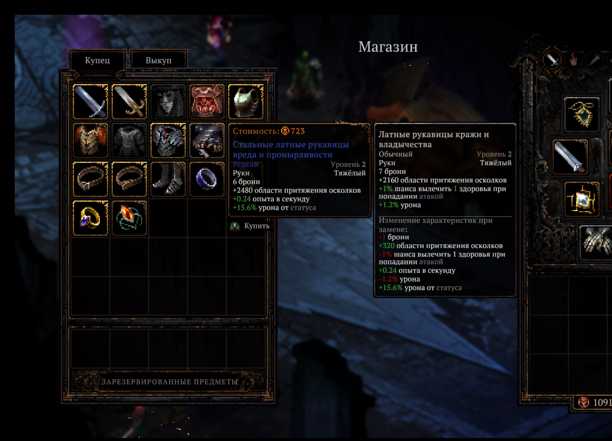
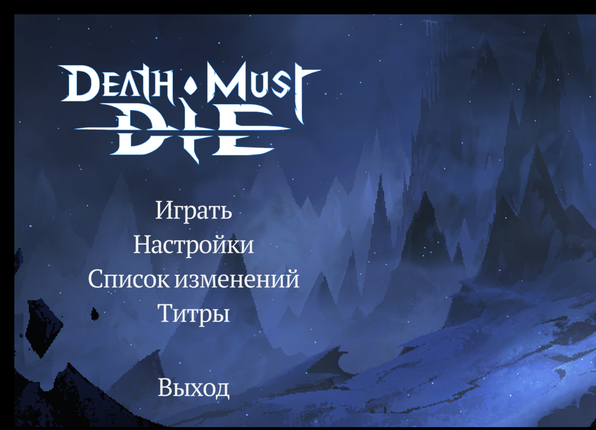

# Death Must Die — Русификатор / Russian Localization

[]() []()

Полная русская локализация для **Death Must Die** (Steam, v0.8.8a). В игре нет выбора языка —
русификатор подменяет английскую локаль.

| | |
|---|---|
| 🖥️ Интерфейс, меню, настройки | ✅ |
| ⚔️ Дары, таланты, статусы, статы | ✅ |
| 🎒 Предметы и случайные названия («Амулет защиты и бодрости») | ✅ |
| 💬 Диалоги героев и богов (2 233 реплики) | ✅ |
| 👤 Род говорящих (Кронт — «я сделал», Скади — «я сделала») | ✅ |
| 🔤 Кириллические шрифты | ✅ |

<p float="left">
  
  
</p>

## Установка

На выбор два ZIP — файлы внутри одинаковые, отличается только способ использования.

**Способ 1 — авто (ZIP `auto`):** распакуй **где угодно** (Рабочий стол и т.п.) и дважды кликни
`УСТАНОВИТЬ-русификатор.bat`. Установщик сам найдёт игру через Steam.

**Способ 2 — в папку игры (ZIP `v-papku-igry`):** распакуй **прямо в папку игры**
(`...\steamapps\common\Death Must Die`) и дважды кликни `УСТАНОВИТЬ-русификатор.bat`.
Работает даже если Steam не установлен.

В обоих случаях установщик сам сделает резервную копию заменяемых файлов (папка `backup_game`
рядом со скриптом) и выставит язык en в настройках игры (русский подставлен именно вместо
английского). Ничего дополнительно ставить не нужно — используется встроенный в Windows PowerShell.

**Ручной способ** (то же самое, с возможностью указать путь к игре):

```powershell
powershell -ExecutionPolicy Bypass -File Install-Rus.ps1
# powershell -ExecutionPolicy Bypass -File Install-Rus.ps1 -GamePath "C:\...\Death Must Die"
```

## Удаление

Дважды кликни `УДАЛИТЬ-русификатор.bat`, либо:

```powershell
powershell -ExecutionPolicy Bypass -File Uninstall-Rus.ps1
```

## Важно

- ⏸️ **Поставь обновления игры в Steam на паузу.** Мега-патч с 4-м актом (вторая половина 2026)
  заменит файлы, и русификатор потребуется пересобрать. Откатить игру можно через
  Steam → Свойства → Бета-версии, либо просто переустановкой.
- Файлы русификатора собраны под **v0.8.8a**. После патча игры сначала запусти
  `Uninstall-Rus.ps1`.

## Что внутри

```
УСТАНОВИТЬ-русификатор.bat / УДАЛИТЬ-русификатор.bat   установка/удаление в один клик
Install-Rus.ps1 / Uninstall-Rus.ps1   установщик / деинсталлятор
catalog.json                          каталог Addressables (CRC снят с изменённых бандлов)
StandaloneWindows64/                  русские таблицы строк (en + bg бандлы)
Data/                                 шрифты с кириллицей (sharedassets0 + resources)
translation/                          исходники перевода для будущих патчей игры
  ru_build.json                         финальные таблицы (11 000 строк)
  strings_en.json                       английские оригиналы
  GLOSSARY.md                           термины и имена
  GUIDE.md / DIALOG_DESIGN.md           правила перевода + матрица пола спикеров
  narrative/                            диалоги: оригиналы CSV + русские CSV
tools/                                полный пайплайн сборки (Python + UnityPy)
docs/                                 скриншоты
```

## Как это устроено (кратко)

- Игра использует Unity Localization: 54 строковые таблицы в бандле
  `localization-string-tables-english(en)`. Русский текст записывается прямо в них.
- Диалоги героев лежат отдельно — в CSV (`Nar_*`) внутри `sharedassets0.assets`,
  русский пишется в колонку English (порядок локалей захардкожен: en → bg).
- Для кириллицы расширены атласы шрифтов в `sharedassets0.assets` / `resources.assets`.
- В `catalog.json` отключена CRC-проверка изменённых бандлов, иначе Addressables их не грузят.

## Сборка из исходников

Нужны Python 3.12+ и `pip install UnityPy`:

```powershell
python tools/21_build.py          # таблицы из translation/ru_build.json
python tools/74_patch_narrative.py # диалоги в sharedassets0
```

## Благодарности

- [SamhainGhost](https://steamcommunity.com/sharedfiles/filedetails/?id=3752768587) и его русификатор — рабочая схема каталога
  и база для сравнения качества перевода.
- Realm Archive — за игру.

---
*Фанатский проект. Все права на игру принадлежат Realm Archive.*
